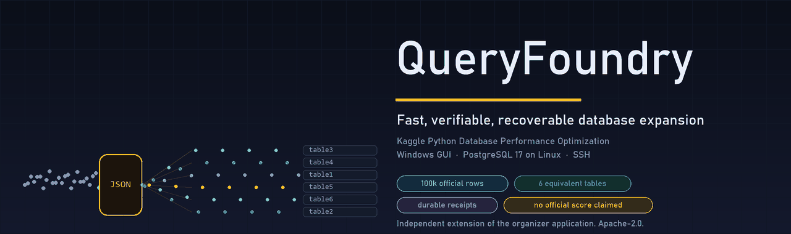
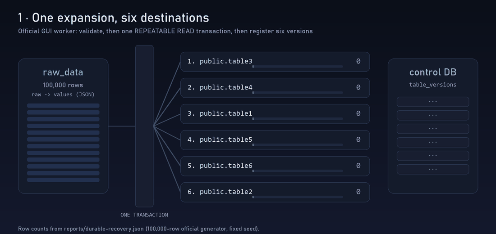
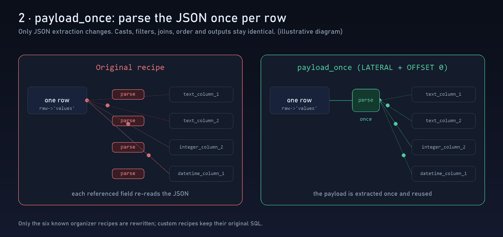
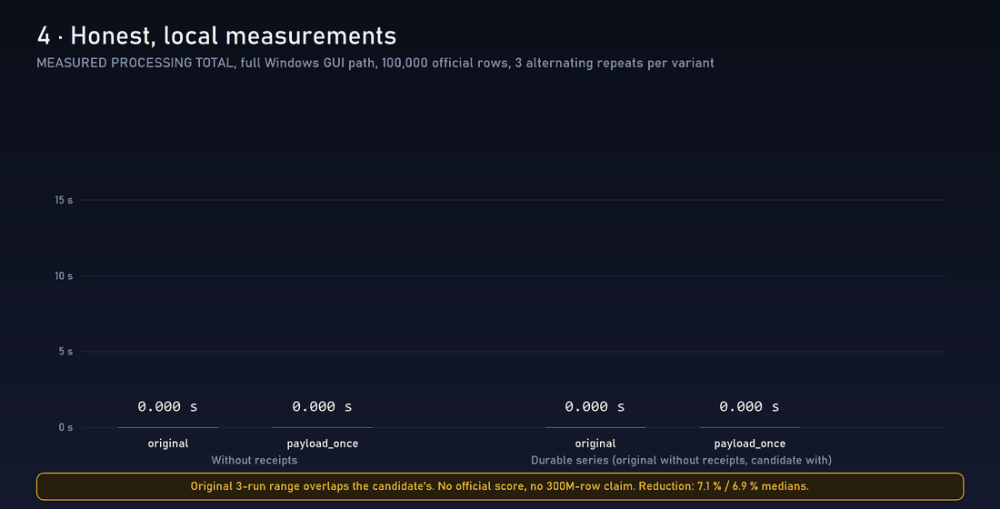
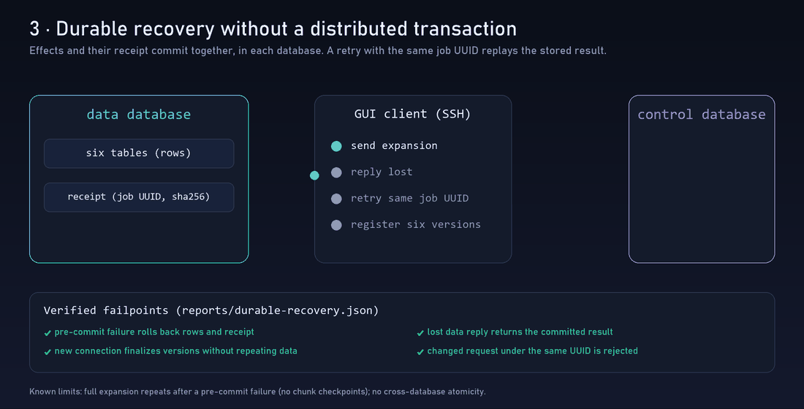
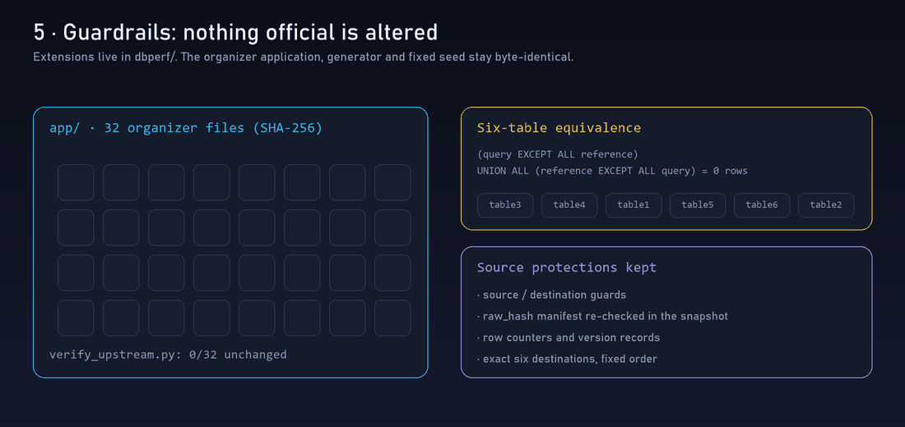

<div align="center">



**Verifiable performance and durable recovery for the Kaggle *Python Database Performance Optimization* challenge.**

[](LICENSE)
[](docs/RULES.md)
[](docs/STATUS.md)
[](scripts/verify_upstream.py)

[Español](README.es.md) · [Results](#results) · [How it works](#how-it-works) · [Recovery](#durable-recovery) · [Integrity](#integrity-guardrails) · [Reproduce](#reproduce) · [Limits](#honest-limits)

</div>

---

QueryFoundry is an **independent extension** of the organizer's Windows application. The official
GUI, generator and fixed seed live byte-for-byte in `app/`; everything we add lives in `dbperf/`.
Nothing here claims an official score or a 300-million-row capacity: every number below is a local,
reproducible measurement with its scope stated.

## How it works



The unchanged GUI worker validates the source, expands `raw_data` into the six destinations
(`table3, table4, table1, table5, table6, table2`) inside **one** `REPEATABLE READ` transaction and
registers six versions in the control database.

### `payload_once`: parse the JSON once per row



Only JSON extraction is rewritten (`LATERAL` with an `OFFSET 0` barrier). Casts, filters, joins,
ordering and outputs are unchanged, and only the six known organizer recipes are touched; custom
recipes keep their original SQL. See [`dbperf/recipes.py`](dbperf/recipes.py).

## Results



| Series (100,000 official rows, 3 alternating repeats, full Windows GUI path) | Original | `payload_once` | Change |
|---|---:|---:|---:|
| Without receipts | 14.245 s | 13.239 s | −7.1 % |
| Durable series¹ | 13.868 s | 12.911 s | −6.9 % |

¹ In the durable series only the candidate runs with receipts; the original does not
(`scripts/benchmark_gui.py`). The ranges of the three runs overlap, so treat the gain as
indicative, not established. Peak container working set ≈ 633–643 MiB. Peak temporary disk is **not
yet measured**. Metric: `MEASURED PROCESSING TOTAL`. Reports: [`reports/`](reports).

The subsequent **1,000,000-row capacity pilot** completed with equivalent six-table
outputs: original155.491s, candidate145.662s (one pair, exploratory). Sampled working
set1.863/1.926GiB under a2GiB limit. It measured the count-guard revision `bfb2b44`;
this pilot predates content-fingerprint changes. See
[`docs/RESEARCH-LOG.md`](docs/RESEARCH-LOG.md) and [`reports/scale-1000000/`](reports/scale-1000000/).

The strengthened recovery revision `c0c7e27` has a separate **100,000-row** full-GUI
benchmark: original **15.875 s** without recovery, candidate **15.094 s** with
content/schema checks and receipts, three alternating repeats (**−4.92%** locally).
Ranges overlap (15.375–16.698 s versus 14.925–15.837 s); this is exploratory.
All six outputs match in every run. Sampled working set: 797.223/790.141 MiB.
Reports: [`reports/research-fingerprint-100k/durable-gui/`](reports/research-fingerprint-100k/durable-gui/).
Do not infer recovery overhead by comparing separate historical series.

## Durable recovery

### Current research candidate: `lazy_keys`

Claude proposed deferred field extraction for `table2`. Codex reproduced 800
invalid-input differential cases on Linux plus 150 `payload_once` control cases;
output checksums and exact error messages matched the original. A rejected rewrite
was detected by the same harness. Qualification order remains planner-dependent;
this is evidence for tested cases, not every possible execution plan.

At 100,000 official rows, three balanced full-GUI rounds at `3c62b85` gave:

| Variant | Median total | Median table2 insertion |
|---|---:|---:|
| Original, without recovery | 15.588 s | 6.741 s |
| `payload_once`, with strengthened recovery | 15.567 s | 5.734 s |
| `lazy_keys`, with strengthened recovery | 12.342 s | 3.423 s |

`lazy_keys` reduced measured time locally by 20.82% versus the original and
20.72% versus `payload_once`. Six-table equivalence passed every run. All runs
are retained, including the first original total of 25.973 s. No significance or
official score is established. The old `payload_once` gain was not reproduced
in this three-way series. Default remains `payload_once`; opt in with
`python launch.py --recipe-mode lazy_keys --recovery`.
Reports: [`reports/research-lazy-100k/durable-gui/`](reports/research-lazy-100k/durable-gui/).



`--recovery` stores a durable receipt in the same transaction as the effects, in each database.
A retry with the same job UUID returns the stored result instead of repeating work; a changed
request under the same UUID is rejected. There is no distributed transaction: a restart between the
two commits resumes version registration from the data receipt. Details and verified failpoints:
[`docs/RECOVERY.md`](docs/RECOVERY.md), [`reports/durable-recovery.json`](reports/durable-recovery.json).

## Integrity guardrails



```bash
python scripts/verify_upstream.py   # 32 organizer files unchanged (SHA-256)
```

Outputs are compared with a bidirectional `EXCEPT ALL` against a reference, normalising surrogate
identities and preserving relations. Source/destination guards, row counters, manifests and version
records are preserved.

## Reproduce

```bash
pip install -r requirements-lock.txt
python scripts/verify_upstream.py
python launch.py                 # measured recipes
python launch.py --recovery      # + durable receipts
python launch.py --baseline      # original recipes
python scripts/build_assets.py   # regenerate the animations in docs/assets
```

Lab setup (Docker, WSL, SSH) is described in [`docs/DOCKER-REPAIR.md`](docs/DOCKER-REPAIR.md);
rules in [`docs/RULES.md`](docs/RULES.md); reuse in [`docs/REUSE.md`](docs/REUSE.md).

## Honest limits

- No official score, no accepted submission, and no demonstrated capacity at 300 million rows.
- A pre-commit failure repeats the full expansion: there are no chunk checkpoints yet.
- Research receipts now check counts and typed row-hash sums before replay; tested
  deletions and same-count alterations are rejected. These are noncryptographic,
  version/locale-bound checksums; legacy receipts need independent validation.
- Concurrency, server restart and dump/restore checks are recent, single-lab results (see
  `reports/research-consistency*.json`); they are not independent replications.
- An early-filter position rewrite was rejected for changing malformed-input errors.
  Negative results are preserved in `experiments/` and `reports/sparse-semantics.json`.
- Source manifests compare stored `raw_hash` metadata, not a recalculated JSON
  checksum. A clone-only race probe detected hash changes but accepted JSON edits
  preserving stored hashes. Such mutated fixtures are excluded from benchmarks.

## License

Apache-2.0. Includes byte-preserving organizer sources from
`igorsiecz/kaggle_postgre_challenge` (commit `5dfde9d`); original notices are kept in `app/` and
[`NOTICE`](NOTICE).
